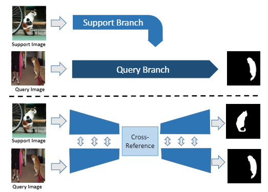
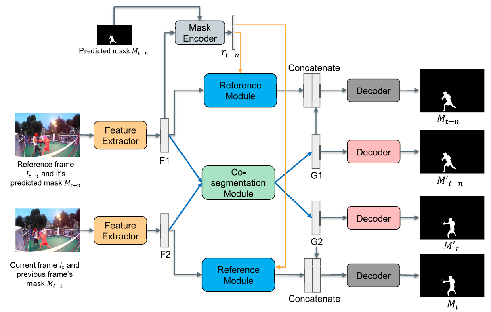
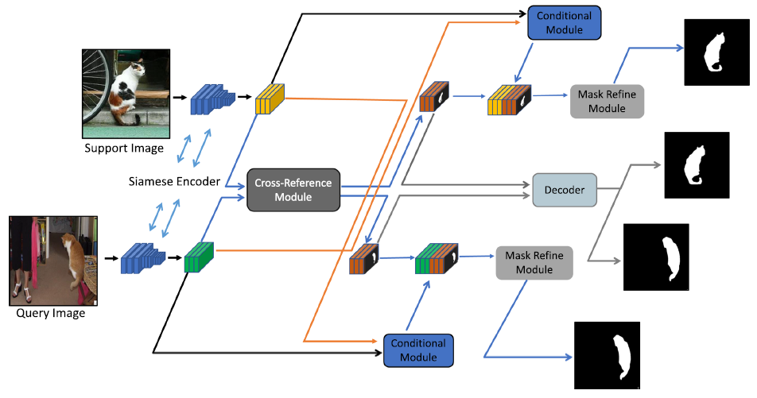
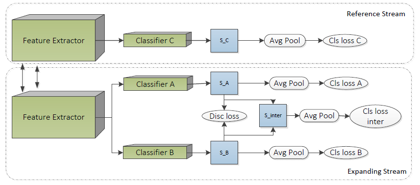
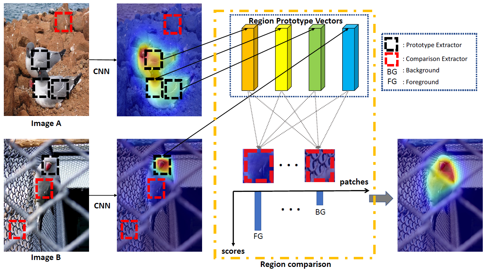
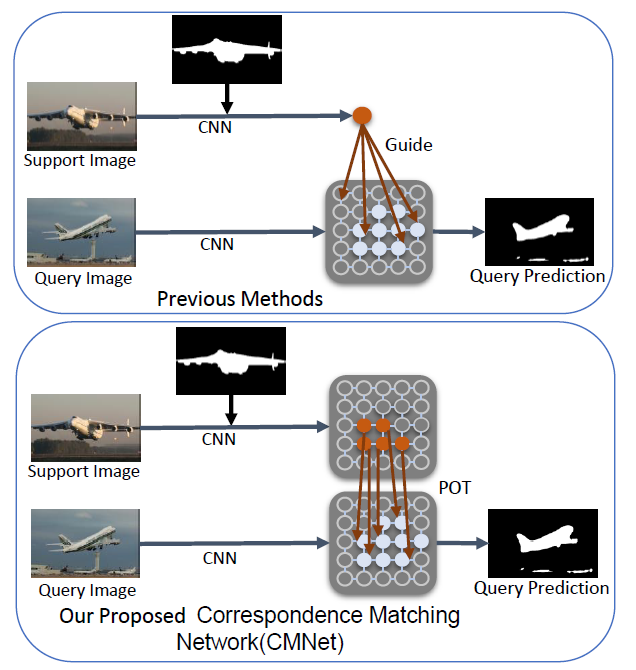
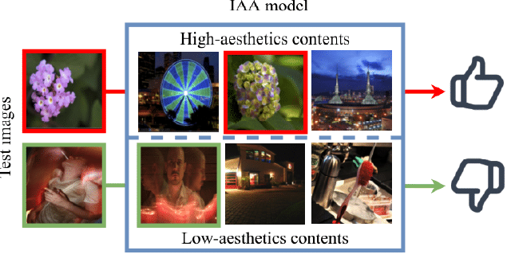
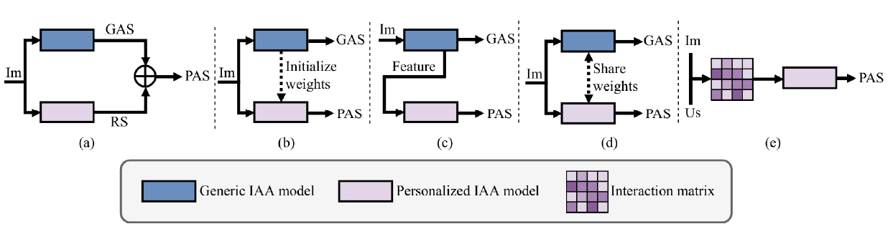
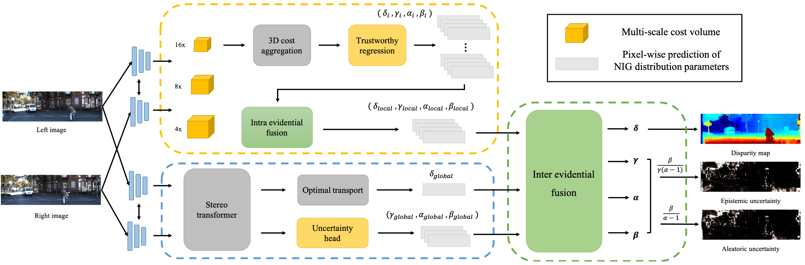
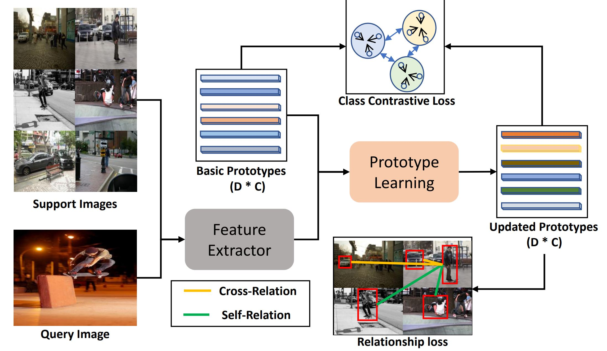

## Biography
 
Weide Liu is currently a Research Fellow at <a href="https://hms.harvard.edu/">Harvard Medical School, Harvard University</a>. Before that, he was a Research Scientist at A*STAR and ByteDance AI Lab in Singapore. 
Weide received his Ph.D. and Bachelor's degree from <a href="https://www.ntu.edu.sg/">Nanyang Technological University</a>. 
His research interests include computer vision, language, machine learning, and medical image analysis. 
If you are interested in joining/visiting or remotely collaborating with our group at Harvard Medical School, please do not hesitate to drop me an email with your resume. 
 

## News

<!-- - **[Feb. 2025]** One paper was accepted by *TOMM*. -->
<!-- - **[Feb. 2025]** One paper was accepted by *Medical Physics*. -->
<!-- - **[Dec. 2024]** One paper was accepted by *IEEE TIM*. -->
- **[Feb. 2026]** One paper was accepted by ***International Journal of Computer Vision(IJCV)***.
- **[Nov. 2025]** One paper was accepted by **AAAI**.
- **[May. 2025]** One paper was accepted by *IEEE TMM*.
- **[2025]** Invited as ***Associate Editor*** for Journal of Visual Communication and Image Representation
- **[Mar. 2025]** One papers was accepted by ***Imaging Neuroscience***.
- **[Mar. 2025]** One papers was accepted by ***NeuroImage***.
- **[Mar. 2025]** Several papers were accepted, including *TOMM*,*Medical Physics* ,*IEEE TIM* and *Neurocomputing*.
- **[Feb. 2025]** Two papers were accepted by ***CVPR 2025***.
- **[Feb. 2025]** One paper was accepted by ***IEEE TIP***.
- **[Nov. 2024]** Invited as Special ***Session Chair*** for IEEE ICME.
- **[Nov. 2024]** One paper about Retinal Image Quality Assessment was accepted by *IEEE TMI*.
- **[Nov. 2024]** One paper was accepted by *IEEE TCSVT*.
- **[Nov. 2024]** One paper was accepted by TMLR.
- **[2024]** Invited as ***Associate Editor*** for Signal, Image and Video Processing.
- **[Oct. 2024]** Invited as DAAD AInet Fellow.
- **[Oct. 2024]** Two papers have been accepted by Neurocomputing and WACV.
- **[Sep. 2024]** One paper was accepted by *IEEE TMM*.
- **[Aug. 2024]** Received the **Best Paper Award** at the IJCAI Workshop.
- **[Aug. 2024]** One paper was accepted by *IEEE TCSVT*.
- **[Jun. 2024]** One paper about federated time-series learning was accepted by *IEEE TII*.
- **[Jun. 2024]** One paper about federated time-series learning was accepted by *IEEE TMM*.
<!-- - **[May. 2024]** One paper was accepted by ICIP. -->
<!-- - **[May. 2024]** Two papers were accepted by EMBC.  -->
- **[May. 2024]** One paper was accepted by *TIV*.
- **[Feb. 2024]** One paper about stereo matching was accepted by ***CVPR 2024***.
- **[Jan. 2024]** Invited as Special ***Session Chair*** for IEEE ICIP.
- **[Dec. 2023]** Several papers were accepted, 1 *AAAI*, 1 IEEE *JBHI*.
- **[Oct. 2023]** One paper about few-shot learning was accepted by ***IJCV***.
- **[Sep. 2023]** One paper about long-tailed recognition was accepted by *Pattern Recognition*.
- **[Aug. 2023]** One paper was accepted by *IEEE TIP*.
- **[Jul. 2023]** One paper about depth estimation was accepted by ***ICCV 2023***.
- **[May. 2023]** One paper was accepted by *IEEE ICIEA*.
- **[May. 2023]** Invited as **Track Chair** for IEEE IECON 2023.
- **[Apr. 2023]** One paper was accepted by *IEEE JBHI*.
- **[Mar. 2023]** One paper was accepted by *IEEE TCSVT*.
- **[Feb. 2023]** One paper was accepted by *ICASSP 2023*.
- **[Dec. 2022]** One paper was accepted by *IEEE TCSVT*.
- **[Nov. 2022]** One paper was accepted by *IEEE TMM*.
- **[Jun. 2022]** One paper was accepted by *IEEE TMM*.
- **[Jun. 2022]** One paper was accepted by ***IJCV***.
- **[Dec. 2021]** One paper was accepted by *IEEE TMM*.
- **[Jul. 2020]** One paper was accepted by *IEEE TCSVT*.
- **[Jun. 2020]** One paper was accepted by ***ECCV 2020***.
- **[Mar. 2020]** One paper was accepted by *ACM MM 2020*.
- **[Dec. 2019]** One paper was accepted by ***CVPR 2020***.

## Selected Publications  [Link](https://liuweide01.github.io/pub)
[comment]: <>

  

<strong>CRNet: Cross-Reference Networks for Few-Shot Segmentation</strong>
 
<strong>Weide Liu</strong>, Chi Zhang, Guosheng Lin, Fayao Liu
 
<em>Proceedings of the IEEE/CVF Conference on Computer Vision and Pattern Recognition. <strong><i style="color:#1e90ff">CVPR</i></strong>.</em>
 
 

[comment]: <>

  

Guided Co-Segmentation Network for Fast Video Object Segmentation
                      <a href="https://dr.ntu.edu.sg/bitstream/10356/151820/2/TCSVT_Final_v2.pdf">Paper Link</a> 

                    

                         <strong>Weide Liu</strong>, Guosheng Lin, Tianyi Zhang, Zichuan Liu
                    

                    
<em>IEEE Transactions on Circuits and Systems for Video Technology(TCSVT)</em>

 
 

[comment]: <>

  

CRCNet: Few-shot Segmentation with Cross-Reference and Region-Global Conditional Networks
                      <a href="https://link.springer.com/article/10.1007/s11263-022-01677-7">Paper Link</a>
                    

                    

                        <strong>Weide Liu</strong>, Chi Zhang, Guosheng Lin, Fayao Liu
                    

                  
<em>International Journal of Computer Vision(IJCV)</em>

 
 

[comment]: <>

  

Weakly Supervised Segmentation with Maximum Bipartite Graph Matching
                      <a href="https://dl.acm.org/doi/abs/10.1145/3394171.3413652">Paper Link</a> 

                    

                        <strong>Weide Liu</strong>, Chi Zhang, Guosheng Lin, Tzu-Yi HUNG, Chunyan Miao
                    

                    
<em>Proceedings of the 28th ACM International Conference on Multimedia (28th ACM MM )</em>

 
 

[comment]: <>

  

Splitting vs. Merging: Mining Object Regions with Discrepancy and Intersection Loss for Weakly Supervised Semantic Segmentation
                      <a href="https://www.ecva.net/papers/eccv_2020/papers_ECCV/papers/123670664.pdf">Paper Link</a> 

                    

                        Tianyi Zhang, Guosheng Lin, <strong>Weide Liu</strong>, Jianfei Cai, Alex Kot
                    

                    
<em>European Conference on Computer Vision (ECCV 2020)</em>

 
 

[comment]: <>

  

Cross-Image Region Mining with Region Prototypical Network for Weakly Supervised Segmentation
                      <a href="https://arxiv.org/pdf/2108.07413">Paper Link</a> /  <a href="https://github.com/liuweide01/RPNet-Weakly-Supervised-Segmentation">Github</a> 
                    

                    

                        <strong>Weide Liu</strong>,  Xiangfei Kong, Tzu-Yi Hung, Guosheng Lin
                    

                  
<em>IEEE Transactions on Multimedia(TMM)</em>

 
 

[comment]: <>

  

Few-shot Segmentation with Optimal Transport Matching and Message Flow
                      <a href="https://arxiv.org/pdf/2108.08518">Paper Link</a> /  <a href="https://github.com/liuweide01/CM-Net-Few-shot-Segmentation">Github</a>
                    

                    

                        <strong>Weide Liu</strong>, Chi Zhang, Henghui Ding, Tzu-Yi Hung, Guosheng Lin
                    

                  
<em>IEEE Transactions on Multimedia(TMM)</em>

 
 

[comment]: <>

  

Distilling Knowledge from Object Classification to Aesthetics Assessment
                      <a href="https://arxiv.org/pdf/2206.00809">Paper Link</a>
                    

                    

                        Jingwen Hou, Henghui Ding, Weisi Lin, <strong>Weide Liu</strong>, Yuming Fang
                    

                  
<em>IEEE Transactions on Circuits and Systems for Video Technology(TCSVT)</em>

 
 

[comment]: <>

  

Interaction-Matrix Based Personalized Image Aesthetics Assessment
                      <a href="https://ieeexplore.ieee.org/document/9817633">Paper Link</a>
                    

                    

                        Jingwen Hou, Weisi Lin, Guanghui Yue, <strong>Weide Liu</strong>, Baoquan Zhao
                    

                  
<em>IEEE Transactions on Multimedia(TMM)</em>

 
 

[comment]: <>

  

ELFNet: Evidential Local-global Fusion for Stereo Matching
                      <a href="https://arxiv.org/pdf/2308.00728">Paper Link</a> /  <a href="https://github.com/jimmy19991222/ELFNet/tree/main">Github</a> 
                    

                    

                        Jieming Lou, <strong>Weide Liu</strong>, Zhuo Chen, Fayao Liu, Jun Cheng
                    

                  
<em>IEEE International Conference on Computer Vision(ICCV)</em>

 
 

[comment]: <>

  

Harmonizing Base and Novel Classes: A Class-Contrastive Approach for Generalized Few-Shot Segmentation
                      <a href="https://link.springer.com/article/10.1007/s11263-023-01939-y">Paper Link</a> /  <a href="https://github.com/liuweide01/HBNC">Github</a> 
                    

                    

                        <strong>Weide Liu</strong>, Zhonghua Wu, Yang Zhao, Yuming Fang, Chuan-Sheng Foo, Jun Cheng, Guosheng Lin
                    

                  
<em> International Journal of Computer Vision (IJCV)</em>

 
 

<!-- ## Activities -->

                <h2>Services</h2>
                <ul><li>Associate Editor for Signal, Image and Video Processing, 2024 - present.</li>
                    <li>Track Chair: IECON 2023.</li>
                  <li>Area Chair: ICME 2024, ICIP 2025.</li>
                    <li>Conference Reviewer: CVPR, ICCV, ECCV, NeurIPS, ICML, ICLR, AAAI, IJCAI, ACCV, ICASSP, ICME, MICCAI, ICIP, etc.</li>
                    <li>Journal Reviewer: TPAMI, IJCV, TIP, TNNLS, TMM, TCSVT, TIFS, SPL, JBHI, TETCI, PR, etc.</li>
                </ul>
            

